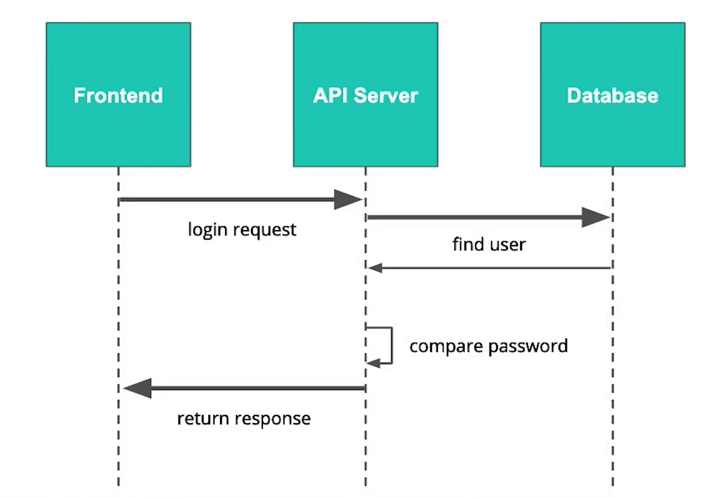

# Identitiy and Authenticaiton

Identity and authentication are essentially asking the question: who is making a request to the digital systems? In this lesson, we will explore different techniques to identify and authenticate, such as usernames and passwords, or multi-factor authentication.

## Authentication in the Digital World

Let's look at a brief overview of the concepts we'll be covering. If you don't understand all of the details given in this video at this stage, don't worry—we're going to go over all of this in much greater detail throughout the lesson!

In a simplified fashion where there are only the frontend and the API server, a user will interact with the frontend and sending a request to the API server. Then a process will verify the identity. Once the identity is verified, a response will be returned.

In this lesson, we will discuss the following topics related to authentication:

- Common authentication method
- Alternative authentication methods
- Third-party auth systems
- Implementing Auth0
- JSON web token (JWT) - data structure and validation
- Local storage
- Sending tokens

## Username and Passwords

The most common authenticating technique is using a username and password pair.

Once a user submits the username and password pair, this information is sent to the API server. Then a request is made to the database using the unique username to pull that user's information including the ground truth password or the representation of the ground truth password.

Then the representation of the password is brought into the API server, where we can compare the two passwords. If the password entered by the user matches the ground truth password stored in the database, we can pass a 200 response to the frontend, allowing that login. If they don't match, we can reject the attempt with a 401 HTTP status code.



### HTTP Status Codes

Two status codes which are important throughout this course are:

- 401 Unauthorized

The client must pass authentication before access to this resource is granted. The server cannot validate the identity of the requested party.

- 403 Forbidden

The client does not have permission to access the resource. Unlike 401, the server knows who is making the request, but that requesting party has no authorization to access the resource.

### Brief intro to Password Problems

There are some issues with passwords are outside of our control as developers. Many issues come from user behavior that we cannot directly influence, such as:

- Users forget their passwords
- Users use simple passwords
- Users use common passwords
- Users repeat passwords
- Users share passwords

In contrast, some issues are within our control as developers:

- Passwords can be compromised
- Developers can incorrectly check
- Developers can cut corners

## Alternative Authentication Methods

### Single Sign-On

Single sign-on is essentially trusting someone else to answer who you are. When users log in to a platform, they can use another platform such as Google, Facebook as a single sign-on provider to authenticate their identities.

### Multi-Factor Authentication

Multi-factor authentication provides us one layer of trust on top of passwords. Essentially, it trusts that you and only you have access to something physical or sensitive and secure.

Once the server validates the initial login request, an additional code is sent to a user's alternative device or service. The user will receive the code and send it back to the server where the code will be checked. Once the code is confirmed valid, the user's login request is allowed.

### Passwordless

Taking multi-factor authentication to an extreme, we have passwordless. To make the authentication passwordless, we remove the password. When a user makes a request, he only has to send the user ID and the server will then send a code to the alternative device. Then the user will use the frontend to send the code back to the server.

### Biometric Authentication

Biometric authentication uses a part of your body to authenticate into a system. The most commonly realized biometric authentication method is fingerprint authentication.

> Note: These alternative methods are not sure proof. As with all systems presented, there are always still risks associated with the method. For example, multi-factor auth has and continues to be thwarted with malicious apps on android which used to be able to read SMS messages. Once this vulnerability was discovered, Google changed the permission system to access these messages. However, the adversaries found a new exploit, by reading the message in the notification bar(opens in a new tab). By combining these methods, and thinking about the most critical parts of the system, you as the developer can minimize risk - but never truly eliminate it.

## Third Party Auth Systems

### Why Delegate the Responsibility?

There are risks associated with implementing the systems ourselves. Most of the risks lie in the backend and are developer risks.

**Monolithic** architecture is great for smaller systems where you only have a few endpoints and a few responsibilities. But it might be overwhelming to maintain and manage when the system's complexity begins to grow. Often in a monolithic service with many responsibilities, there might be interdependencies that make it difficult to change your code. It is called technical debt that might lead to mistakes and vulnerabilities.

**Microservices** take individual responsibilities and split them into smaller servers. All the systems are self-contained and minimal interaction between them is needed. But if the authentication service is embedded within each of these systems, and we change it in one system, we may have to make the change across all other systems. To solve this issue, we can create the authentication service as a microservice of its own - acting as a single self-contained system to handle everything related to authentication.

A **token** is a credential that is temporary and allows the frontend to remember who that person is for subsequent requests.

### Common Auth Services:

- Auth0, We'll be using this throughout the course!
- AWS Cognito
- Firebase Auth
- Okta

## Implementing Auth0

Here, we want our front-end to interact with Auth0, a third-party service, to provide the login screen and perform the authentication.

We will direct clients to a hosted page provided by Auth0 to perform authentication. Auth0 is fully responsible for the login actions within their service and redirect clients back to our frontend with the JSON Web Token (JWT) of that authenticated request. That JWT can be passed along to our various services which need to authenticate users.

We will introduce more about JSON web token (JWT) in the next few concepts.

### Auth0 Authorize Link

The complete documentation for the authorization code flow can be found in Auth0's Documentation(opens in a new tab). It may help to fill in the url in the textbox below before copying it into your browser:

```
    https://{{YOUR_DOMAIN}}/authorize?audience={{API_IDENTIFIER}}&response_type=token&client_id={{YOUR_CLIENT_ID}}&redirect_uri={{YOUR_CALLBACK_URI}}
```

### Integrating Auth0 With Your Frontend

To integrate Auth0 with your frontend you simply need to redirect your user to your Auth0 hosted login page and include a url to redirect them to upon completion. This can be done using a simple html anchor link:

```
<a href="{{AUTH0_AUTHORIZE_URL}}">Login</a>
```

For a more seamless user experience, you can (and should) set up a custom domain on Auth0 by following the instructions in their docs(opens in a new tab). This is also a good idea to minimize the risk of Phishing Attacks(opens in a new tab) by ensuring that your users do not accidentally enter their credentials into a login form that just looks like yours.

## JSON Web Tokens (JWTs)

Recall that users will submit information from our frond-end to a third-party authentication service such as Auth0. If the login is successful, the authentication service will return a successful result along with a token. This token will be used in subsequent requests whenever our services need to authenticate the user.

JSON web tokens (JWT) are intrinsically stateless, meaning that our server knows that this token is valid and works regardless of the state of a session. When JWT is passed to the front-end then to the server, that server only has to fetch a public key one time from the authentication service. The key will then be stored in the server to verify the JWT. Stateless also solves the problem of scalability.

### JWT - Datastructure

In its raw form, a JSON web token (JWT) is just a string. Although it looks like a bunch of random letters and numbers, hidden within is actually an intuitive structure.

A JWT can be broken into three main parts: header, payload, and signature. These three parts work together to ensure that the information within the JWT is consistent and that we can validate that the information has not been changed.

The string of JWT uses an algorithm called Base64 to encode the information as well as decode the information. It is a two-way transformation between a well-formatted text and a jumbled-up-looking text.

Recall that a JWT contains three parts: header, payload, and signature.

- Payload stores specific information about the user such as a username or user ID*.*
- Header includes an algorithm used to sign the token such as HS256

However, since base64 is very easy to use, it raises a question if that JWT sent to our server is indeed generated by a system that we trust and the JWT is containing the authentic identity of the individual making that request.

Since base64 is a standard algorithm and very easy to use, anyone can produce a JWT like token very easily. We need to know how we can trust that this JWT is indeed authentic and has not been tampered with.

The **signature** part of the JWT will help us verify that the information in the JWT is not tampered with and comes from a trusted source. It is dependent on the header, payload, and secret. A secret is a string stored on the authentication service and on the server that will validate the JWT.

If the secret is not known by a third party, they cannot sign the information within their payload or header. If the header or payload changes and the secret remains the same, the signature will change. As a result, if the signature strings match, we can trust that the data within the JWT is authentic. But if not, we know that the information has been tampered with in transit.

## Local storage

Local Storage(opens in a new tab) is an implementation of a key-value store(opens in a new tab) that is accessible through a javascript interface in most modern browsers. It is a general purpose interface to store strings which will persist in memory from session to session. It is designed for smaller strings and alternative opensource systems like localForage(opens in a new tab) exist for large amounts of data.

There could be some time before storing and getting the JWTs. But there should not be a problem as long as the JWT has not expired between the time that it was retrieved and stored and the time it was sent to the server.

To store the JWT using local storage, we use:

```py
jwt = response.jwt
localStorage.setItem("token", jwt)
```

To use the JWS, we recall it from the store:

```py
jwt = localStorage.getItem("token")
```

### Security Considerations

There are inherent risks associated with using local storage. For example, a malicious attack can inject foreign code into a website to execute on that website to access all of the keys within the local store and drops it into the malicious server.

To mitigate the risks, we discuss Input Sanitation(opens in a new tab). To clarify this concept, imagine a user submits HTML as part of their name in a form. When you later pull this information from your database and insert it into the HTML template for the website, the browser engine will render(opens in a new tab) this text on the page. However, if the text contains HTML like <b>Gabe</b> this would be interpreted in the browser as HTML and render as Gabe. This becomes a problem if malicious code, such as javascript, is saved in place of a valid string. In other words, this malicious text will be interpreted by the browser as code and executed on the client. Input Sanitation(opens in a new tab) transforms characters like < to &lt; which will not be interpreted as code and print as text (<). This step should always be performed on the server to prevent someone from sending the malicious text directly to your server using curl(opens in a new tab) or Postman(opens in a new tab).

We also mentioned NPM or Node Package Manager(opens in a new tab) this is an online database of publicly submitted libraries you can use in your javascript projects. Other public databases of code libraries such as PIP for Python(opens in a new tab) or Brew for Mac(opens in a new tab). Some care should be taken to ensure that these packages are compliant with your license and security policies and are monitored for security vulnerabilities.

## Sending Tokens

An authorization header is a string. It includes a keyword prepended to the JWT called bearer, which indicates what type of token is included in the authentication header. It also includes the token. Bearer and token are separated by a space.

To unpack an authorization header, we can add the following code to the app.py

```py
def headers():
    auth_header = request.headers['Authorization']
## get the token
    header_parts = auth_header.split(' ')[1]
    print(header_parts)
```

> NOTE: This step does not validate if a JWT is authentic and has not been tampered with. We'll cover those checks in Practice - Applying Skills in Flask.

We can also pass a few conditions to make sure everything is valid.

```py
def get_token_auth_header():
## check if authorization is not in request
    if 'Authorization' not in request.headers:
        abort(401)
## get the token   
    auth_header = request.headers['Authorization']
    header_parts = auth_header.split(' ')
## check if token is valid
    if len(header_parts) != 2:
        abort(401)
    elif header_parts[0].lower() != 'bearer':
        abort(401) 
return header_parts[1]

app = FLASK(__name__)

@app.route('/headers')
def headers():
    jwt = get_token_auth_header()
    print(jwt)
    return "not implemented"
```

To make it as a decorator, you can use the following code.

```py
from functools import wraps
def requires_auth(f):
    @wraps(f)
    def wrapper(*args,* *kwargs):
        jwt = get_token_auth_header()
        return f(jwt, *args,* *kwargs)
    return wrapper

@app.route('/headers')
@requires_auth
def headers(jwt):
    print(jwt)
    return "not implemented"
```
