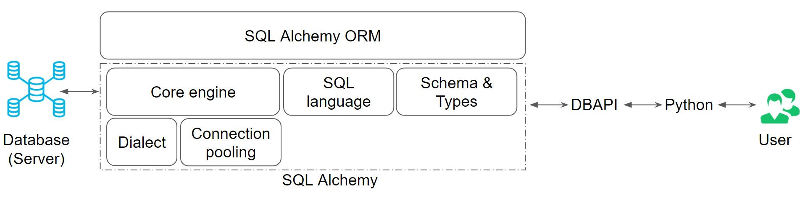

# SQL Alchemy

In this lesson, we will introduce SQL Alchemy, a library in Python that can enable effective and efficient DB interaction for your app. We will specifically look at:

- How the components of SQL Alchemy and ORM are structured
- What are dialects
- What is a connection pool
- How does the core engine work
- How classes and tables are mapped
- How models are defined
- How data types are handled
- How to define constraints

SQLAlchemy is the most popular open-source library for working with relational databases from Python.

It is one type of ORM library, AKA an Object-Relational Mapping library, which provides an interface for using object-oriented programming(opens in a new tab) to interact with a database.

Other ORM libraries that exist across other languages include popular choices like javascript libraries Sequelize(opens in a new tab) and Bookshelf.js(opens in a new tab) for NodeJS applications, the ruby library ActiveRecord(opens in a new tab), which is used inside Ruby on Rails(opens in a new tab), and CakePHP(opens in a new tab) for applications written on PHP, amongst many other such ORMs.

> ###### Note on ORMs: are they a "best practice"?
>
> Using an ORM to interact with your database is one of many useul approaches for how you can have layers of abstraction in your web application allowing it to interact with a database more easily. Additionally,there are numerous query builder libraries you can use that are somewhere between talking to a database directly (with a database driver library like pyscopg2), and using an ORM. An ORM is considered to be the highest possible level of abstraction you can add to a web application for database management. Query Builder libraries are right there in the middle. There are mixed reactions about whether ORMs are a best practice approach in all cases, such as this opinion on "Why you should avoid ORMs"(opens in a new tab).
>
> SQLAlchemy offers multiple levels of abstraction between the database driver and the ORM, so you can customize the development of your web application. These granular levels of abstraction are one of the reasons that has led to its widespread popularity.

Below a list of some features offered by SQLAlchemy.

- Features function-based query construction: allows SQL clauses to be built via Python functions and expressions.
- Avoid writing raw SQL. It generates SQL and Python code for you to access tables, which leads to less database-related overhead in terms of the volume of code you need to write overall to interact with your models.
- Moreover, you can avoid sending SQL to the database on every call. The SQLAlchemy ORM library features automatic caching, caching collections, and references between objects once initially loaded.

The diagram below can give you insight into where SQL Alchemy and ORM are in the big picture.

