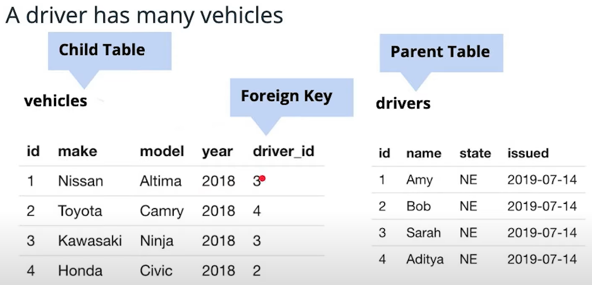
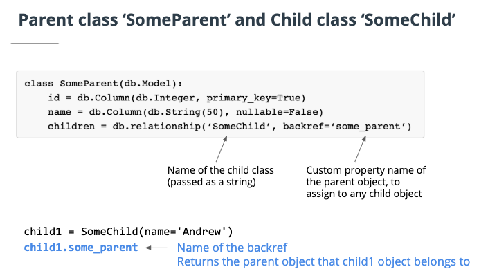

# CRUD

In this lesson, you will learn about the following topics, and also apply each to an actual app that you will be creating:

- Model View Controller
- Handling Input
- Getting user data in Flask
- Using AJAX to send data back to Flask
- Using sessions in controllers
- Implementing update functionality: update a todo item's completed state
- Implementing delete functionality: remove a todo item
- Model relationships between objects in SQL and SQLAlchemy
- Setting up Foreign Key constraints

Building CRUD on Lists of To-Do items
Handling the special case of modeling many-to-many relationships

So far, we've built up a lot of the conceptual foundation we'd need to understand how to do real-world web development across the stack. In these next series of lessons from now until the end of this course, we'll pivot to becoming very hands-on, building a fully functional application from start to end.

Following every screencast, an interactive workspace will be provided so you can **follow along in coding** the steps of building out this To-Do application. You'll be building out the same application from now until the end of this course across these next 3 lessons. The starter code is provided above every instance of your workspace, in case you make a mistake somewhere and want to start from a clean slate at any point.

Below, it's share the equivalence between the user actions, the SLQ instructions and the ORM instructions:

- CREATE -> INSERT -> DB.SESSION.ADD(USER1)
- READ -> SELECT -> User.query.all()
- UPDATE -> UPDATE -> user1.foo = 'new value'
- DELETE -> DELETE -> db.session.delete(user1)

In summary, here are the skills we'll master over these next 3 lesson as we build out this application:

- Traversing across all layers of our backend stack, from our backend server in Flask to our database in Postgres, by understanding mappings between user operations, to the ORM, to the SQL executed on a database.
- Developing using the MVC Model-View-Controller pattern, for architecting out our application
- Handling changes to our data schema over time
- Modeling relationships between objects in our web application
- Implementing Search

We'll cover these skills through a hands-on approach by building out our to-do application across these next 3, final lessons of this section!

## MVC

MVC stands for Model-View-Controller, a common pattern for architecting web applications
Describes the 3 layers of the application we are developing

- _Models_ manage data and business logic for us. What happens inside models and databases, capturing logical relationships and properties across the web app objects
- _Views_ handle display and representation logic. What the user sees (HTML, CSS, JS from the user's perspective)
- _Controllers_ routes commands to the models and views, containing control logic. Control how commands are sent to models and views, and how models and views wound up interacting with each other.

How a banking app on your phone uses the MVC model is: the storage of all transactions, balances, profiles, and accounts is part of the model since it is all about data. The brain and logic, or controller, is the code that runs the code behind all screens and interactive elements on the app itself. The graphical user interface, represented by the actually installed app on the phone is what users see. This is the view.

Creating, updating, and deleting information from a database requires handling user input on what is being created/updated/deleted.

Below are the responsibilities of each layer to achieve oru to do app.

- On the view: implement an HTML form
- On the controller: retrieve the user's input, and manipulate models
- On the models: create a record in our database, and return the newly created to-do item to the controller
- On the controller: take the newly created to-do item, and decide how to update the view with it.

There are 3 methods of getting user data from a view to a controller:

1. URL query parameters
2. Forms
3. JSON

The way form data traverses from the client to server differs based on whether we are using a `GET` or a `POST` method on the form.

The POST submission

- On submit, we send off an HTTP POST request to the route /create with a request body
- The request body stringifies the key-value pairs of fields from the form (as part of the name attribute) along with their values.

The GET submission

- Sends off a GET request with URL query parameters that appends the form data to the URL.
- Ideal for smaller form submissions.

POSTs are ideal for longer form submissions, since URL query parameters can only be so long compared to request bodies (max 2048 characters). Moreover, forms can only send POST and GET requests, and nothing else.

Commits can succeed or fail. On fail, we want to rollback the session to avoid potential implicit commits done by the database on closing a connection. It is a good practice to close connections at the end of every session used in a controller, to return the connection back to the connection pool. This is reflected with the `pattern (try-except-finally)`

```py
import sys

try:
   todo = Todo(description=description)
   db.session.add(todo)
   db.session.commit()
except:
   db.session.rollback()
   error=True
   print(sys.exc_info())
finally:
   db.session.close()
```

## Glossary

- MVC, or Model-View-Controller, is a design and architectural pattern that breaks up an application into three elements: the model(the data), the view(the graphical interface that users see), and the controller(the code-logic behind the app) It is an industry-standard web development framework used heavily throughout the world.
- Ajax allows web pages to be updated fast through asynchronously exchanging small amounts of data back and forth with the server. It allows only a part of a web page to be updated without reloading the entire page.
- CRUD Any database should be able to (C)reate, (R)ead, (U)pdate, and (D)elete data.
- A session represents all interactions with the database and actually implements a “holding zone” for all the data objects that were affected during this time. They can be finalized (made permanent) by committing the changes, or rolling back if unwanted'
- XMLHttpRequest (XHR) objects are used to interact with servers in order to get data from a URL (or page) without having to do an actual full page refresh. Web pages can update just a small part of a page without interrupting what the user is doing. XMLHttpRequest is used heavily in AJAX programming.
- Migrations are code-based strategies that allow you to manipulate the schema or data in a database after it has already been created and has data in it. They are useful for recording changes, as well as providing a way to "rollback" changes. There can be several migration files "stacked" on top of one another in order.

## Updating a resource

An update involves setting the attributes of an existing object in the database.

In SQL:

```sql
UPDATE table_name
SET column1 = value1, column2 = value2, ...
WHERE condition;

```

In SQLAlchemy ORM:

```py
user = User.query.get(some_id)
user.name = 'Some new name'
db.session.commit()
```

In order to implement a checkbox that's based on the to-do items completed state, we're going to need to learn a little bit more about the Jinja templating engine, that's in Flask, and we're going to need to learn particularly about statements that allow us to do conditional if-statements.

So using the documentation link below, we can see how to use the if statement in Jinja where we can do something like `iftodo.completed`, show this particular attribute in HTML.

## Deleting a resource

Deletes deal with removing existing objects in our database

In SQL:

```sql
DELETE FROM table_name
WHERE condition;
```

In SQLAlchemy ORM:

```py
todo = Todo.query.get(todo_id)
db.session.delete(todo) # or...
Todo.query.filter_by(id=todo_id).delete()
db.session.commit()
```

Steps we'll implement:

- Loop through every To-Do item and show a delete button
- Pressing the delete button sends a request that includes which to-do item to delete
- The controller takes the user input, and notifies the models to delete the To-Do object by ID
- On successful deletion by the models, the controller should notify the view to refresh the page and redirect to our homepage, showing a fresh fetch of all To-Do items to now exclude the removed

## Modeling relationships

So far, we've completed doing CRUD for a single model: a To Do item. The CRUD implementation patterns we've learned can apply to multiple models for any given web application, so long as those models do not have relationships between them. However, we'll often be implementing web apps with multiple models that have relationships with one another.

The relationships between these models can determine if certain actions on one model should happen on other models, so that when something happens to one model, related model objects should also be affected (by being created, read, updated, or deleted).

Examples are:

- Removing a User's account should remove all of that user's photos, documents, etc.
- Deleting a Discussion Thread should delete all of its comments.
- Deactivating the profile of an Airbnb host should deactivate all of that host's listings.
- Accessing a Blog Post should also access all of its comments.
- Accessing an Airbnb host's profile should also access all of their listings.

In order to handle CRUD across related models that can often have relationships with one another, we'll need to learn about how we model relationships, both reviewing relationship modeling in SQL and learning particularly about how we implement them in SQLAlchemy ORM.

Let's put aside our To-Do app development for now to learn about mapping relationships between models. Once we've done that, we'll come back to our To-Do app to implement them.

In relational databases, we can map relationships that occur

- between tables
- between rows across tables

For example, if we have a table storing driver information and then another table storing vehicle information, we can establish a relationship, that says, a driver has many vehicles. From establishing that relationship, we can get certain information, such as the particular driver Amy, has two vehicles in particular; a 2018 Nissan Altima and 2007 Ninja 250 for example.

We retrieve information across tables using foreign keys. So a foreign key is stored on what is known as the child table, vehicles in this case which retrieves the primary key in the parent table, mapping a relationship from parent to child. The foreign key is always stored in the child table and we say that a child object belongs to a parent objects through the foreign key that's stored on the child table. So, the way that we would query information about child records from a parent record or a parent records from a child record is using a select statement that includes a join



So, this particular select join statement. Answers the question, what is the make, model, and year of vehicles that the driver named Sarah has? Drivers being the parents, vehicles being the child, joining from child to parent on a foreign key that exists on the child.

```sql
SELECT make, model, year from vehicles
  JOIN drivers
  on vehicles.driver_id = driver_id
  WHERE driver.name = 'Sarah';
```

SQLAlchemy configures the settings between model relationships once and generates JOIN statements for us whenever we need them.
`db.relationship` is an interface offered in SQLAlchemy to provide and configure a mapped relationship between two models.
`db.relationship` is defined on the parent model, and it sets; the name of its children (e.g. children), for example parent1.children; the name of a parent on a child using the `backref`, for example `child1.my_amazing_parent`.



When calling `child1.some_parent`, SQLAlchemy determines when we load the parent from the database.

Why is it important to care about when we load parents?

- Joins are expensive.
- We should avoid having the user idling. Delays more than 150ms are noticeable, so milliseconds of performance matter!
- We should make sure the joins happen during a time and place in the UX that doesn't negatively

### Lazy loading

Load needed joined data only as needed. Default in SQLAlchemy.

- Pro: no initial wait time. Load only what you need.
- Con: produces a join SQL call every time there is a request for a joined asset. Bad if you do this a lot.

### Eager loading

Load all needed joined data objects, all at once.

- Pro: reduces further queries to the database. Subsequent SQL calls read existing data
- Con: loading the joined table has a long upfront initial load time.

lazy=True (lazy loading) is the default option in `db.relationship`.

## Seting up Foreign keys

In SQL,

```sql
CREATE TABLE vehicles (
  id INTEGER PRIMARY_KEY,
  make VARCHAR NOT NULL,
  model VARCHAR NOT NULL,
  year INTEGER NOT NULL,
  driver_id REFERENCE drivers(id) # ForeignKey
);
```

In SQLAlchemy,

```py
class Drive (db.model):
  __tablename__ = 'drivers'
  id = db.Column(db.Integer, primary_key=true)
  ...
  vehicles = db.relationship)'Vehicle',backref='drivers,lazy=true)


class Vehicle (db.model):
  __tablename__ = 'vehicles'
  id = db.Column(db.Integer, primary_key=true)
  make = db.Column(db.String(), nullable=False_
  ...
  driver_id = db.Column(db.Integer, db.ForeignKey('drivers.id'),nullable=False)
```
