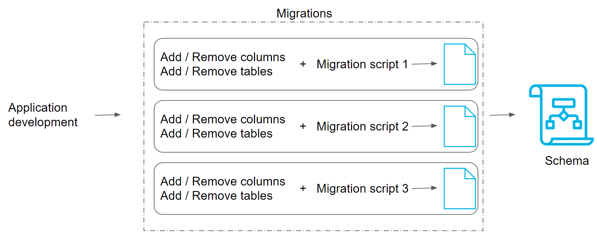

# Migrations

In this lesson, we will learn how to make changes to your data or schema during project development.

- What are migrations
- Why we use migrations
- How to install necessary libraries
- Steps to get migrations going
- Upgrades and Downgrades

Migrations deal with how we manage modifications to our data schema, over time. Mistakes to our database schema are very expensive to make. The entire app can go down, so we want to quickly rollback changes, and test changes before we make them.

A Migration is a file that keeps track of changes to our database schema (structure of our database). Offers version control on our schema.

> Think migrations like git commits in git version control system.

## Upgrades and rollbacks

- Migrations stack together in order to form the latest version of our database schema
- We can upgrade our database schema by applying migrations
- We can roll back our database schema to a former version by reverting migrations that we applied

The next image illustrate how migrations scripts are coordinated to upgrade and schema.

A common case to use migrations could be: Imagine you are a database administrator for a university. You have a large database of student records, but the government has mandated a new requirement for vaccinations for all students. This column must be added to the database. Because the database is already live, this allows you to alter both the schema as well as repopulate with default data. By using the migration tool, should this requirement ever become not required, we could easily downgrade. It is useful for auditing as there is a record.

Migrations encapsulate a set of changes to our database schema, made over time in files that are uniquely named and are usually stored as local files in our project repo, (e.g. a `migrations/` folder). There should be a 1-1 mapping between the changes made to our database, and the migration files that exist in our migrations/ folder. Our migrations files set up the tables for our database. All changes made to our DB should exist physically as part of migration files in our repository.
There are generally 3 scripts needed, for

- `migrate`: creating a migration script template to fill out; generating a migration file based on changes to be made
- `upgrade`: applying migrations that hadn't been applied yet ("upgrading" our database)
- `downgrade`: rolling back applied migrations that were problematic ("downgrading" our database)

Flask-Migrate is our library for migrating changes using SQLAlchemy. It uses a library called Alembic underneath the hood. There are two ways to run our migrations:

1. Flask-Migrate (flask_migrate) is our migration manager for migrating SQLALchemy-based database changes
2. Flask-Script (flask_script) lets us run migration scripts we defined, from the terminal

The steps to get migrations going

1. Initialize the migration repository structure for storing migrations
2. Create a migration script (using Flask-Migrate)
3. (Manually) Run the migration script (using Flask-Script)

## Why use migrations?

Without migrations:

- We do heavy-handed work, creating and recreating the same tables in our database even for minor changes
- We can lose existing data in older tables we dropped

With migrations:

- Auto-detects changes from the old version & new version of the SQLAlchemy models
- Creates a migration script that resolves differences between the old & new versions
- Gives fine-grain control to change existing tables

This is much better, because

- We can keep existing schema structures, only modifying what needs to be modified
- We can keep existing data
- We isolate units of change in migration scripts that we can roll back to a “safe” db state

Without flask, in order to add a column, we would modify the mode, drop the table, and recreate based on new models. All data would have to be regenerated. Using Migrate, allows us to keep current schemas, and only change what is needed, plus all data is intact

## Overall Steps to Set Up & Run Migrations

1. Bootstrap database migrate commands: link to the Flask app models and database, link to command-line scripts for running migrations, set up folders to store migrations (as versions of the database)
2. Run initial migration to  create tables for SQLAlchemy models, recording the initial schema: ala git init && first git commit. Replaces use of db.create_all()
3. Migrate on changes to our data models
  - Make changes to the SQLAlchemy models
  - Allow Flask-Migrate to auto-generate a migration script based on the changes
  - Fine-tune the migration scripts
  - Run the migration, aka “upgrade” the database schema by a “version”
