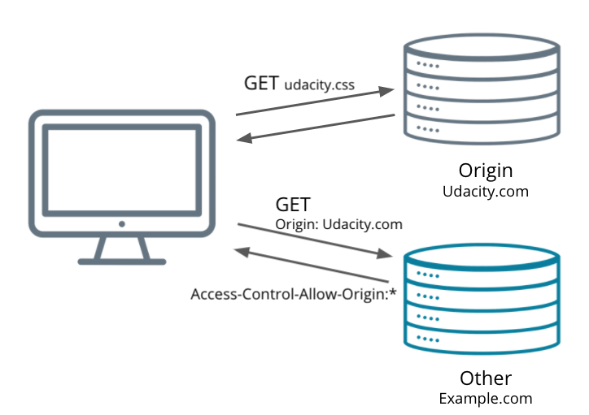

# Endpoints and Payloads

In the last lesson, you gained an understanding of HTTP and the ability to set up a basic Flask app. In this lesson, you'll learn about how to extend the Flask microframework so that we can:

- Organize API Endpoints
- Handle Cross-Origin Resource Sharing (CORS)
- Parse the request path and body
- Use POST, PATCH, and DELETE requests in Flask
- Handle errors

To accomplish this, we'll need to use a new library, called Flask-CORS

## Principles

- Should be intuitive
- Organize by resource
    - Use nouns in the path, not verbs
    - The method used will determine the operation taken
        GOOD:
            https://example.com/posts
        BAD:
            https://example.com/get_posts
- Keep a consistent scheme
    - Plural nouns for collections
    - Use parameters to specify a specific item
        GOOD:
            https://example.com/entrees
            https://example.com/entrees/5
        BAD:
            https://example.com/entree
            https://example.com/entree_five
- Don’t make them too complex or lengthy
    - No longer than collection/item/collection
        GOOD:
            https://example.com/entrees/5/reviews
        BAD:
            https://example.com/entrees/5/customers/4/reviews

## Methods & Endpoints Review

The request method used will determine the operation performed for the given resource URI. Though your API documentation should explain exactly what operation is performed and data returned via the response, it should be intuitive for anyone using your API, such as in the example below.

| Resource | GET | POST | PATCH | DELETE |
| --- | --- | --- | --- | --- |
| /tasks | Get all tasks | Create a new task | Partial update of all tasks | Delete all tasks |
| /tasks/1 | Get the details of task 1 | Error! | Partial update of task 1 | Delete task 1 |
| /tasks/1/notes | Get all the notes for task 1 | Create a new note for task 1 | Partial update of all notes of task 1 | Delete all notes of task 1 |

In summary, we connect our endpoints to the methods that we talked about. For each endpoint, the table below shows what each method should do.

## CORS

If you've had a little experience as a web developer, you may have seen an error in the browser:

```
No 'Access-Control-Allow-Origin' header is present on the requested resource
```

This error is all about Cross-Origin Resource Sharing or CORS. Let's see what that's all about.

The same-origin policy is a concept of web security that allows scripts in Webpage 1 to access data from Webpage 2 only if they share the same domain. This means that the above error will be raised in the following cases:

- Different domains
- Different subdomains (example.com and api.example.com)
- Different ports (example.com and example.com:1234)
- Different protocols (http://example.com and https://example.com)

This is not, however, to say that it is really an error. It is behaving exactly as it should. This policy is there to protect you and your users. For instance, attackers may embed malicious scripts in advertisements. This policy prevents those scripts from successfully making requests to your bank's website as you access the website hosting the advertisement.

If you're sending any requests beyond very simple GET or POST requests, then before your actual request is sent, the browser sends a preflight OPTIONS request to the server. If CORS is not enabled, then the browser will not respond properly and the actual request will not be sent.



### CORS Headers

In order for the requests to be processed properly, CORS utilizes headers to specify what the server will allow:

- Access-Control-Allow-Origin
    - What client domains can access its resources. For any domain use *
- Access-Control-Allow-Credentials
    - Only if using cookies for authentication - in which case its value must be true
- Access-Control-Allow-Methods
    - List of HTTP request types allowed
- Access-Control-Allow-Headers
    - List of http request header values the server will allow, particularly useful if you use any custom headers


